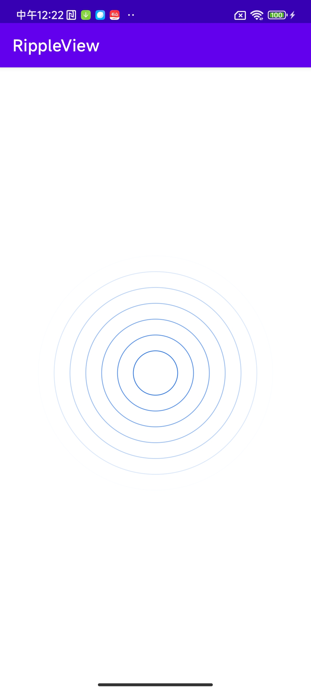

# RippleView
[](https://jitpack.io/#limbowangqi/RippleView)

### 🔥🔥🔥水波纹效果 [源码分析](https://www.yuque.com/limbo-mwwms/xi0rm8/utipyv00yq5bqfup?singleDoc#)
### 效果预览


### 添加依赖
```grovy
allprojects {
  repositories {
    ...
    maven { url 'https://jitpack.io' }
  }
}
```
```grovy
dependencies {
  implementation 'com.github.limbowangqi:RippleView:0.0.1'
}
```

### 一、属性介绍

| 属性                     | 值             | 说明                                                     |
|:-----------------------|:--------------|:-------------------------------------------------------|
| ripple_color            | 颜色值（int）     | 圈的颜色                          |
| ripple_speed_multiple   | 倍率（float）    |  移动速率，默认为1，且大于0          |
| ripple_interval_step    | 单位dp          | 每个圈之间的间隔，不设置默认为当前最大半径的1/2    |
| ripple_stroke_width     | 单位dp          | 绘制圈的画笔的宽度                    |
| ripple_radius_center    | 单位dp           | 中心的内部半径，即最小半径              |
| ripple_alpha            | true or false   | 是否展示透明度，距离中心越远，透明度越低  |

### 二、使用
```xml
   <com.ripple.library.RippleView
        android:id="@+id/ripple_view"
        android:layout_width="match_parent"
        android:layout_height="300dp"
        app:ripple_alpha="true"
        app:ripple_color="#0F63ED"
        app:ripple_interval_step="20dp"
        app:ripple_radius_center="20dp"
        app:ripple_speed_multiple="2"
        app:ripple_stroke_width="1dp" />
```
```kotlin
  binding.rippleView.start()
```
